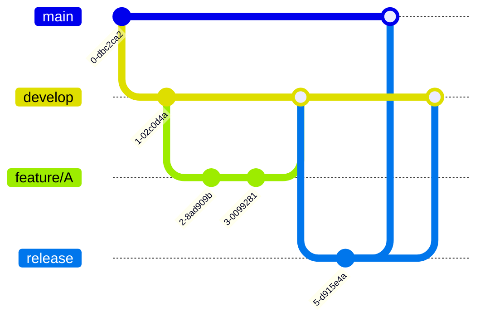
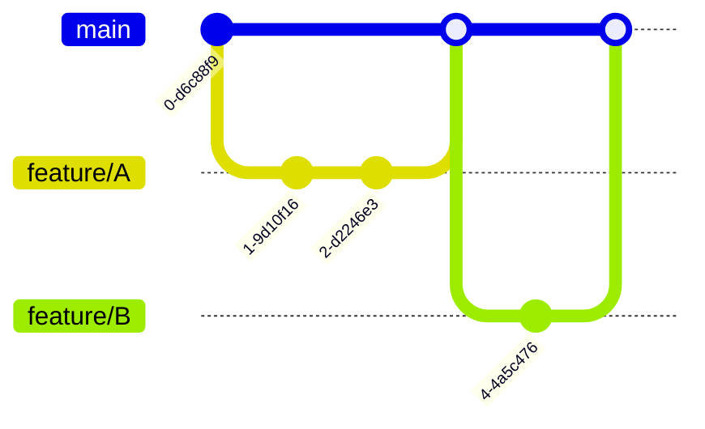

---
tags:
  - git
  - branch-strategy
  - damso
  - development
  - workflow
created: 2024-12-25
project: 담소
status: active
---

# 담소 프로젝트 Git Branch 전략

> [!info] 프로젝트 정보
> **프로젝트명**: 담소 (AI 영상 통화 시스템)
> **팀 규모**: 5명
> **개발 기간**: 4주 MVP
> **데모 주기**: 매주 금요일

---

## 📚 배경 조사

### 참고 자료
- [Git Branch 전략 개요 (YouTube)](https://www.youtube.com/watch?v=Uszj_k0DGsg)
- [우아한형제들 기술블로그: Git Flow 실전 사용법](https://techblog.woowahan.com/2553/)

---

## 🔀 Git Flow vs GitHub Flow 비교

### Git Flow: 체계적이지만 복잡

> [!example] Git Flow 브랜치 구조
> Git Flow는 **5가지 브랜치 타입**을 사용하여 개발(develop)과 배포(main)를 명확히 분리합니다.



**5가지 브랜치:**
- 🏭 **main** (master): 제품으로 출시될 수 있는 안정 브랜치
- 🔧 **develop**: 다음 출시 버전을 개발하는 통합 브랜치
- ✨ **feature**: 개별 기능을 개발하는 브랜치
- 📦 **release**: 출시 버전을 준비하는 브랜치 (QA, 버그 수정)
- 🚨 **hotfix**: 배포된 버전의 긴급 버그를 수정하는 브랜치

> [!success] Git Flow의 장점
> - ✅ 개발과 배포 환경이 명확히 분리됨
> - ✅ 대규모 팀에서 체계적인 협업 가능
> - ✅ 여러 버전을 동시에 관리 가능

> [!warning] Git Flow의 단점
> - ❌ 복잡한 브랜치 구조
> - ❌ 작은 팀에는 오버헤드
> - ❌ 빠른 배포가 어려움

---

### GitHub Flow: 단순하지만 위험

> [!example] GitHub Flow 브랜치 구조
> GitHub Flow는 **main 브랜치에서 feature 브랜치만 생성**하는 단순한 전략입니다.



**구조:**
- 🎯 **main**: 유일한 메인 브랜치
- ✨ **feature/\***: 기능별 브랜치

> [!success] GitHub Flow의 장점
> - ✅ 매우 간단한 구조
> - ✅ 빠른 배포 가능
> - ✅ 작은 팀에 적합

> [!danger] GitHub Flow의 치명적 문제
> **main 브랜치가 개발(dev)과 안정(stable) 버전을 동시에 담당**
> - main에 바로 merge → 개발 중인 불안정한 코드가 배포됨
> - 데모용 안정 버전을 보장할 수 없음
> - 실수로 망가진 코드 배포 시 롤백 어려움

---

## 🎯 우리의 요구사항

> [!important] 필수 조건: Stable과 Dev 환경 분리
> 우리 팀은 **반드시 안정 버전과 개발 버전을 분리**해야 합니다.

### 왜 분리가 필요한가?

1. **📅 매주 금요일 데모**
   - 데모용 안정적인 버전이 항상 준비되어 있어야 함
   - 개발 중인 기능이 데모를 망가뜨리면 안 됨

2. **👥 초보 개발자 팀**
   - 팀원들이 아직 학습 중
   - 실수로 인한 코드 파손 가능성
   - 안전망이 필요함

3. **⏱️ 빠듯한 4주 일정**
   - 데모 실패는 프로젝트 실패를 의미
   - main 브랜치는 항상 안정적이어야 함

> [!question] 그렇다면 Git Flow를 그대로 사용해야 할까?
> **NO!** 우리 상황에 맞게 간소화가 필요합니다.

---

## 🎨 우리 팀의 Git Branch 전략

### 핵심 전략: Simplified Git Flow

> [!tip] 전략 요약
> **Git Flow의 핵심(main/develop/feature 분리)은 유지**하되,
> **MVP 단계에 불필요한 release, hotfix는 제거**

---

### 제거한 브랜치들

#### ❌ Release 브랜치를 제거한 이유

> [!note] Release 브랜치란?
> 출시 전 1-2주간 코드를 동결하고 QA 테스트 및 버그 수정만 하는 브랜치

**우리 팀에 불필요한 이유:**

| Release가 필요한 경우 | 우리의 상황 |
|---|---|
| 전담 QA 팀 존재 | ❌ QA 팀 없음 → develop에서 직접 테스트 |
| 1-2주 QA 기간 필요 | ❌ 목요일 밤 테스트로 충분 |
| 정해진 릴리즈 일정 (월 1회 등) | ❌ 매주 금요일 데모 (주간 주기) |
| 앱스토어 심사 대기 | ❌ 웹 앱 → 즉시 배포 |

> [!example] 우리의 릴리즈 프로세스
> ```
> 수요일 오후: develop 브랜치에 모든 기능 merge
> 수요일 밤: staging.damso.app에서 팀 테스트
> 목요일 아침: develop → main merge
> 목요일 오후: damso.app에서 데모 ✅
> ```

---

#### ❌ Hotfix 브랜치를 제거한 이유

> [!note] Hotfix 브랜치란?
> 배포된 운영 서버에서 긴급 버그 발견 시 main에서 직접 분기하여 수정하는 브랜치

**우리 팀에 불필요한 이유:**

| Hotfix가 필요한 경우 | 우리의 상황 |
|---|---|
| 실제 사용자 서비스 중 | ❌ MVP 개발 단계 (실사용자 없음) |
| 운영 서버 긴급 수정 필요 | ❌ 데모 환경만 존재 |
| develop 병합 대기 시간 없음 | ✅ 금요일 데모 후 다음 주 월요일부터 수정 가능 |

> [!tip] 긴급 수정이 필요하다면?
> Feature 브랜치로 처리:
> - develop에 merge → staging 테스트 → main 배포

---

## 🌳 우리의 브랜치 구조

```
damso (repository)
├── 🏭 main (1개, 영구)
│   └── 역할: 데모용 안정 버전
│   └── 배포: damso.app (production)
│
├── 🔧 develop (1개, 영구)
│   └── 역할: 다음 주 데모 준비
│   └── 배포: staging.damso.app
│
└── ✨ feature/* (5개, 4주간 유지)
    ├── feature/보호자-대시보드
    ├── feature/AI-감정-분석
    ├── feature/영상-통화-녹화
    ├── feature/스토리북-생성
    └── feature/긴급-알림-시스템
```

> [!info] Feature 브랜치 관리
> **왜 4주간 유지?**
> - 5가지 주요 기능을 병렬로 개발
> - 각 기능이 여러 주에 걸쳐 완성됨
> - 완성된 부분만 develop에 merge
> - 4주 후 최종 정리

---
